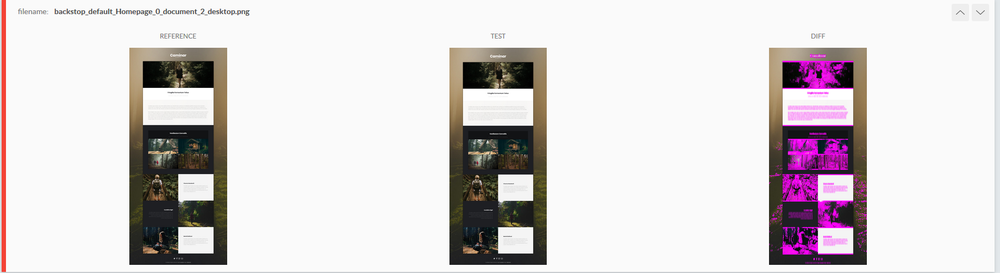
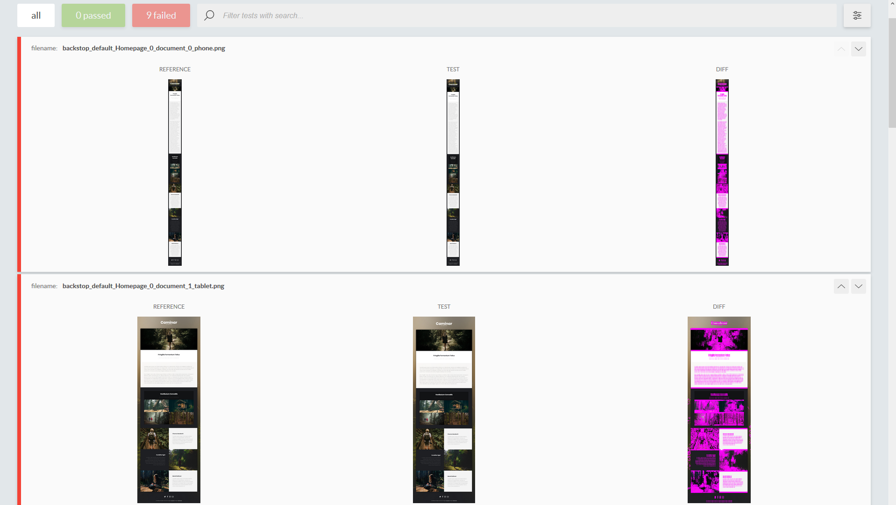
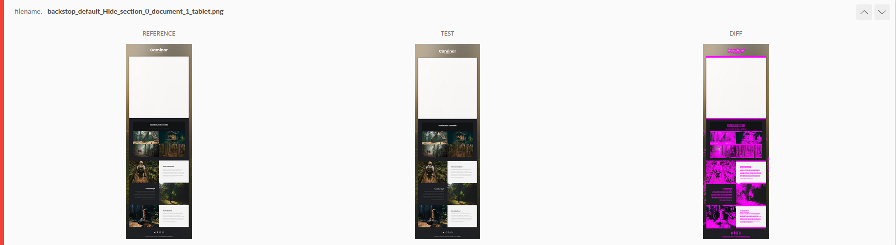

# Testy regresyjne w BackstopJS
**W każdym większym projekcie natrafimy na ten moment, kiedy przestaniemy w pełni kontrolować cały kod. Wtedy pozostanie nam albo marnowanie długich godzin na testy ręczne albo automatyzacja.**

## Jak działają takie testy?
Mechanizm sam w sobie jest bardzo prosty - robimy zrzut ekranu przed i po zmianach, a następnie sprawdzamy czy gdzieś nie pojawiły się jakieś niepożadane efekty.



## Przygotowanie
Pierwszym krokiem jest zainstalowanie **BackstopJS** - najlepiej jest zrobić to globalnie za pomocą:
```
npm install global backstopjs
```

Następnie w naszym projekcie uruchamiamy polecenie:
```
backstopjs init
```

które przygotuje niezbędne foldery i pliki konfiguracyjne.

## Pierwszy test
Do testów postanowiłem użyć szablonu https://templated.co/caminar. 

Następnie utworzyłem dwa foldery:
- backstop.lara/original
- backstop.lara/dev

Pierwszy adres jest tym referencyjnym, a drugi to ten w którym wprowadzam poprawki.

Czas otworzyć plik `backstop.json` - najpierw dodajmy dodatkowe viewporty:
```
"viewports": [
    {
        "label": "phone",
        "width": 320,
        "height": 480
    },
    {
        "label": "tablet",
        "width": 1024,
        "height": 768
    },
    {
        "label": "desktop",
        "width": 1920,
        "height": 1280
    }
],
```

a następnie stwórzmy nasz pierwszy scenariusz:
```
{
    "label": "Homepage",
    "cookiePath": "backstop_data/engine_scripts/cookies.json",
    "url": "http://backstop.lara/dev/",
    "referenceUrl": "http://backstop.lara/original/",
    "readyEvent": "",
    "readySelector": "",
    "delay": 0,
    "hideSelectors": [],
    "removeSelectors": [],
    "hoverSelector": "",
    "clickSelector": "",
    "postInteractionWait": 0,
    "selectors": [],
    "selectorExpansion": true,
    "expect": 0,
    "misMatchThreshold" : 0.1,
    "requireSameDimensions": true
},
```

No to, do dzieła:
```
backstop reference
```
Dzięki niemu zostaną stworzone zrzuty ekranu dla http://backstop.lara/original/.


```
backstop test
```
Porówna obie wersje i przeniesie nas na stronę na której możemy się przyjrzeć różnicom. Jako, że jeszcze nic nie zmieniliśmy wszystkie testy powinny zaświecić się na zielono.

Czas więc coś popsuć. W pliku CSS dopisałem do body `margin-top: 20px`. Efekt? Wszystko na czerwono. Czy to źle? Nie, bo przecież chcieliśmy nadać margines górny. Jeżeli więc uważamy, że obecny stan jest poprawny używamy polecenia:
```
backstop approve
```
za jego pomocą nasze ostatnie testy zostaną uznane za referencyjne, aż do momentu, kiedy ponownie odpalimy `backstop reference`.



## Interakcje
Bardzo często musimy sprawdzić nie tylko jak strona wygląda po wczytaniu, ale też i pewne interakcje. Dopiszmy więc scenariusz w którym klikniemy w link otwierający lightboxa:
```
{
    "label": "Popup",
    "cookiePath": "backstop_data/engine_scripts/cookies.json",
    "url": "http://backstop.lara/dev/",
    "referenceUrl": "http://backstop.lara/original/",
    "readyEvent": "",
    "readySelector": "",
    "delay": 0,
    "hideSelectors": [],
    "removeSelectors": [],
    "hoverSelector": "",
    "clickSelector": ".gallery a",
    "postInteractionWait": 2000,
    "selectors": [],
    "selectorExpansion": true,
    "expect": 0,
    "misMatchThreshold" : 0.1,
    "requireSameDimensions": true
},
```

od poprzednika różni się dwoma linijkami:
```
    "clickSelector": ".gallery a",
    "postInteractionWait": 2000,
```
oznacza to, że najpierw klikamy w link w elemencie o klasie gallery, a następnie czekamy 2 sekundy, żeby mieć pewność, że popup się otworzy.

## Co może pójść nie tak?
### Treść
Głównym problemem zawsze będą treści dynamiczne - o ile teraz pracujemy na statycznej stronie, o tyle gdybyśmy chcieli takie testy zintegrować z naszym WordPressem, będziemy musieli mieć pewność, że porównamy dokładnie takie same treści. 

Ten problem możemy rozwiązać dwojako:
- przed porównaniem screenshotów wyrównamy oba środowiska
- nie będziemy działać na prawdziwych danych - po prostu przygotujemy sobie style guide, który uwzględni wszystkie komponenty.

Pierwsza metoda jest pewniejsza, ale bardziej czasochłonna - szczególnie jeżeli baza danych jest dość ciężka.

Druga zaś uniezależnia nas od treści - musimy jednak ciągle dbać o nasz style guide, żeby był aktualny.

### Losowość
Wyobraźmy sobie, że mamy na stronie box z losową reklamą. Co więc zrobić, żeby nie pokazywał nam się jako różnica? 

Na szczęście w każdym scenariuszu możemy zdefiniować, które elementy chcemy ukryć, a możemy to zrobić za pomocą `hideSelectors`.



### Prędkość serwera
Czasem możemy natrafić na sytuację, kiedy niektóre testy zwrócą różnice, bo jeden z zasóbów nie zdążył się wczytać. Dlatego ważne jest żeby korzystać z dobrodziejstw parametrów `readyEvent`, `readySelector` czy `delay`. Dzięki nim zdefiniujemy kiedy strona naprawdę się wczytała.

### Błąd ludzki
W przeciwieństwie do np. testów jednostkowych, które mogą zwrócić prawdę albo fałsz, tutaj taki test zwraca nam "wygląda, tak jak wyglądało" albo "coś się zmieniło". I do nas należy interpretacja czy to dobrze czy nie.

## Co najlepiej testować?
Najlepiej testować jak najmniej, ale za to różnorodnie. Takie testy są dość wolne i wymagają od nas dodatkowej uwagi. Jeżeli więc postanowimy sprawdzać wszystko - bardzo szybko się zorientujemy, że przestaniemy je stosować, bo zajmują tylko dużo czasu.

Nie ma więc sensu tworzyć osobych testów dla każdej podstrony z osobna, bo większość elementów będzie się powtarzać. O wiele lepiej jest przygotować style guide ze wszystkimi komponentami, takimi jak header, footer, widok pojedynczego wpisu, różne pole formularza, tabele etc.

Warto też przygotować osobny scenariusz dla stanu hover oraz dla różnych interakcji.

## Warto?
Im większy projekt i im więcej ludzi pracujących nad nim, tym szybciej zrozumiemy, że tak. Prędzej czy później zaczniemy wprowadzać poprawki, które nieumyślnie zaczną tworzyć bugi na drugim końcu strony. 

Dodatkowo zyskamy też pewność przy refactoringu.

Dlatego nawet przy małym projekcie warto pomyśleć chociażby o podstawowych scenariuszach.
